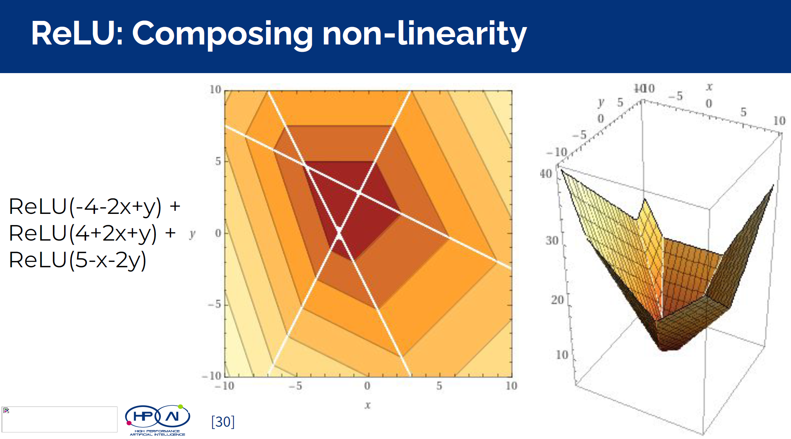
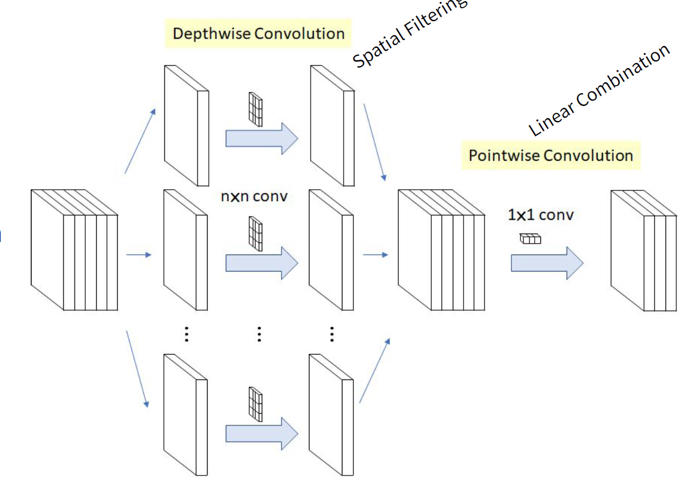
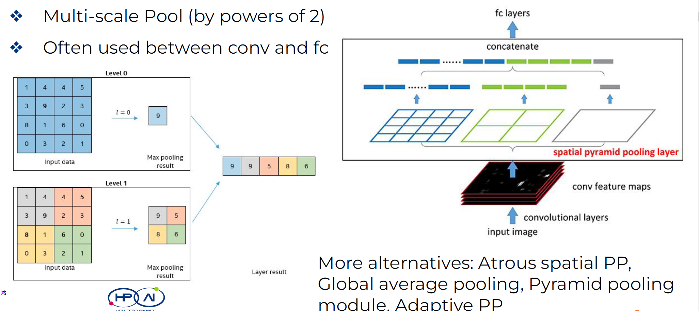
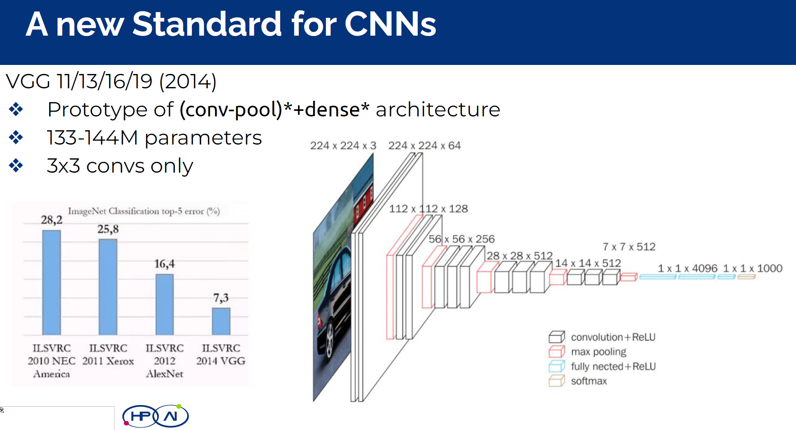
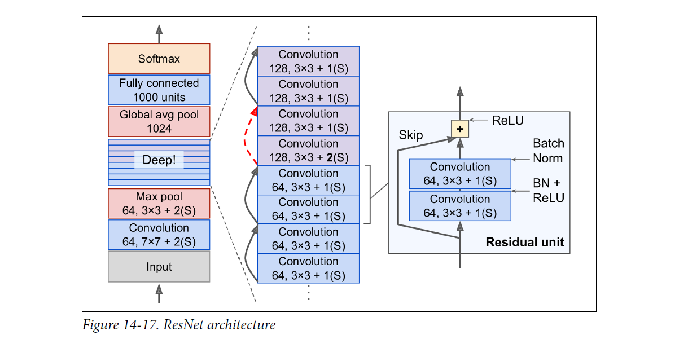
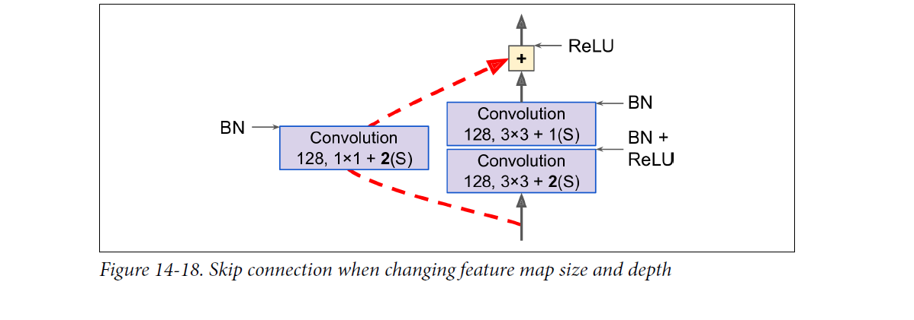

# Deep Learning 
## Lecture 1 Basic DL Concepts & Methods
### Optimization & Learning 
### Gradient Descent
So how to Choose your batch size? 
#### Batch GD 
#### Stochastic GD 
#### Mini-Batch GD
### The Maniford Hypothesis
Deep learning is defined by the high input demensionality 
* How can we find solutions in such a vast space? 
* Manifold Hypothesis: 
  * The space we must navigate has a smaller dimensionality 
  * Most possible inputs are unrealistic 
* Each layer in a NN is a different manifold, transforming the space to facilitate the target task.
### Art and Speed in Descending 
### Inertia in Opetimizers
#### Momentum: adding a fraction of the previous gradients. Inertia. 
#### Nesterov: See the slope ahead
#### Adagrad : Parameter-wise LR considering past updates. High LR for infrequent ones and low LR for frequent ones. 
#### Adadelta
#### RMSprop
#### Adam 
### Activation Function 
ReLU is a safe choice in most cases. 
**Why ReLU works?** 
ReLU is linear, and we need non-linearity! So why? 
ReLU can bend linearity With a bunch of ReLUs 

### Weigh Initialization 
* Small number 
* Half positive & half negative 
* If weights are properly initialized, bias can be zero-init. 
* Normal distribution sample: Ok for shallow, but deviation grows with size. 
* **Glorot/Xavier**: Normalize variance by number of inputs 
* **He/Keming/MRSA**: Specific for ReLUs.

### Regularization  
* Early Stopping: Overfitting is the end of the road; using validation loss/accuracy as the guide.  
* Data Augmentation: think is thoroughly when doing preprocessing.

### Parameter Norm Penalty Method 
* Add a regularizing term to the loss function
  * L2/L1 norm on weights by factor (another hyperparam!)
  * Makes gradients and weights smaller (L1 sparsifies inputs)
  * Safe for SGD, not so for adaptive learning optimizers (e.g., Adam)      
    * uneven normalization :S
* Weight decay is similar to L2-norm (often confused)
  * Scaling factor on the update rule (another hyperparam!)
  * **Analogous to L2-norm for SGD, not for adaptative optimizers** 
  * Theoretically safe for all (if implemented!)
* Max Norm
  * Constraint c
  * Typically around 3 or 4 
  * Goes well with dropout 
  * Maybe redundant with L2-norm/weight decay

### Batch Normalization 
<--->
### Dropout and its variants  
* Dropconnect: Delete edges instead of neurons
* Standout: Rate based on weight (high weight -> high prob.)
* Gaussian Dropout: Faster convergence as no neuron is ever fully disconnected (Gaussian vs Bernoulli)
* Different architectures, different dropouts!

## Lecture2 Convolutional NN 
### Convolutions
#### Normal Convolution
**Kernel Size** ;  **Stride**; **Padding**; 

#### Dilated/Atrous Convolutions 
Spacify the kernel, increase perspective field without added complexity. 
**Hyperparameters: Dilated stride** 

#### Pooling 
Method: **Maxpool** or **Average pool** 
Hyperparameters: **Size** & **Stride**

### Important Blocks & Structures

#### Depth-wise Separable Convolutions 
1. Depth-wise convolutions:  Filters: **N * N * 1**
2. Point-wise convolution:  Filters: **1 * 1 * input_depth** 
 
**Params: N*N+N**
 
#### Spatial Pyramid Pooling (SPP)
Multi-scale Pool (by powers of 2): Often used between conv and fc 
More alternatives: Atrous spatial PP, Global average pooling, Pyramid pooling module, Adaptive PP

#### Inception Module 

#### VGG Block 

#### Skip Connection 
When training a neural network, the goal is to make it model a target function $h(x)$. If you add the input x to the output of the network (i.e., you add a skip connection), then the network will be forced to model $f(x) = h(x) – x$ rather than $h(x)$. This is called residual learning.

#### Spatial Dropout

* Spatial Dropout: Drop entire feature maps, aka channels
* Cutout: Drop connected components along width, height
and/or depth

#### Inverted Residuals and Linear Bottlenecks (Not using)

### Modern Network Module 

#### EfficientNet 
To be continue 

#### Noisy Student (Not Using)

### Bias Detection 
Through XAI Attribution 

### Playing with CNN 
* Encoder-Decoder  Image segmentation 
* U-Net (VIP Encoder-Decoder) 
  
**Transposed Convolution**
* Segmentation 
* GAN 
* Super-resolution 
* UNet

## Practical Tips
### Batch Size 
#### Factors for defining the batch size
* For large instance size, lower batch sizes
* For more computional efficiency, higer batch sizes 
* For more stochasticity, lower batch sizes 
* Use batch sizes in the power of 2
#### Factors for defining the number of epochs
* For better convergence, more epochs
* For more reliablity, more epochs 
* For less footprint, less epochs

### Learning Rate
Tuning the learning rate. 
* Fix the batch size (or viceversa) 
  * Theory: Double one, double the other ?? 
* Always smaller than 1 
* Search by orders of magnitude 
* Grid Search < Random Search ??? 
* In case of doubt, go small    
* When stuck, reduce it. 

### Optimizier 
* Adam: Current popular default: Competitive with minimal tuning. 
* SGD + Momentum: Great if LR decayed properly. 

### Parameter Norm Penalty Method 
* Add a regularizing term to the loss function
  * L2/L1 norm on weights by factor (another hyperparam!)
  * Makes gradients and weights smaller (L1 sparsifies inputs)
  * Safe for SGD, not so for adaptive learning optimizers (e.g., Adam)      
    * uneven normalization :S
* Weight decay is similar to L2-norm (often confused)
  * Scaling factor on the update rule (another hyperparam!)
  * **Analogous to L2-norm for SGD, not for adaptative optimizers** 
  * Theoretically safe for all (if implemented!)
* Max Norm
  * Constraint c
  * Typically around 3 or 4 
  * Goes well with dropout 
  * Maybe redundant with L2-norm/weight decay

### Activation Function 
ReLU is a safe choise in most cases!! 
* **Undying alternatives**: leaky ReLU, PReLU, ELU, SELU... 
**Starts with ReLU. Explore variants as a long shot!**

### Weight Initialization 
We need for:
* Small numbers + half positive, half negative 
* If weight are properly initialized, bias can be zero-init. 
**If using ReLU, Kaiming Initialization. Otherwise Glorot!!** 

### Parameter Norm Penalty Method 
 * L2/L1: Safe for SGD, not so for adaptive learning optimizers (e.g., Adam)      
* Weight decay is Theoretically safe for all (if implemented!)
* Max Norm
  * Constraint c & Typically around 3 or 4 
  * Goes well with dropout 
  * Maybe redundant with L2-norm/weight decay

### Training milestone
* Learn anything 
  * Little capacity makes it easier
  * Rough hyperparameter estimation  
  * Goal: Underfit (Better than random!)  
* Learn everything 
  * Growing capacity 
  * Hyperparameter refinement 
  * Goal: Overfit  
* Learn the right thing
  * Regularization: fit!!  

#### Diagnosing the model
* Diagnosing the curves (loss & accuracy)
* Fail to converge? No trend? 
  * Simplify problem/model 
  * Decrease LR
  * Data corrupted? 
  * Preprocessing?
  * Weight init? 
* Loss explosion? Sudden Spike? 
  * Problematic data instance 
  * Exploding gradients -> weights  
* Loss goes down and accuracy goes down
  * Raw outcome improves, but threshold metric is not met 
  * Imbalance? 

#### Convolution 
* Kernel Size: $(3\times3)$, $(5\times5)$, $(7\times7)$
* Stride: usually **1** or **2**. 
* Padding: **Valid** or **Same**
* No. of filters 
* Dilatation rate: == Dilated Convolution?? 

#### Pooing 
* **Maxpooling**: $2 \times 2$ kernel, stride 1 is the least invasive 
* **Average Pooling**: same as above
* **Global Average Pooling** 
* Padding?? 

#### Data Augmentation 
* Mixup(Merge 2 samples) & AdaMixup(manifold intrusion)  
* CutOut(remove a patch)
* CutMix (merge samples w/m patch)
* Auto/DeepAugment(Learn from ???? , Danger!) 

### Incomplete Hyperparameter list
* Batch size 
* Number of epochs 
* Learning Rate 
* Weight decay
* Activation function 
* Input normalization 
* Weight initialization 
* Data augmentation 
* Network Capacity(layers and neurons) 
* Early stopping policy 
* Normalization layer + hyperparameters
* Loss function
#### Convolution
kernel size, stride, padding, dilated rate
#### Pooling
kernel size, stride, padding, avg/max/global average
#### Dilated convolution
Set in the normal convolution 
#### Skip Connection 
#### Inception block 
#### CBR or CRB Block 
### CCC Block 

### In Summary: Which one works? 
1. Convolution 
1. Recurrent 
1. Bottleneck 
1. Attention
1. Resiual(Skip-connection)
 
**1*1 conv for bottleneck**  

## Implementation 

### Wandb Keral Callbacks 
[Wandb Keras Callback](https://docs.wandb.ai/ref/python/integrations/keras/wandbcallback) 

